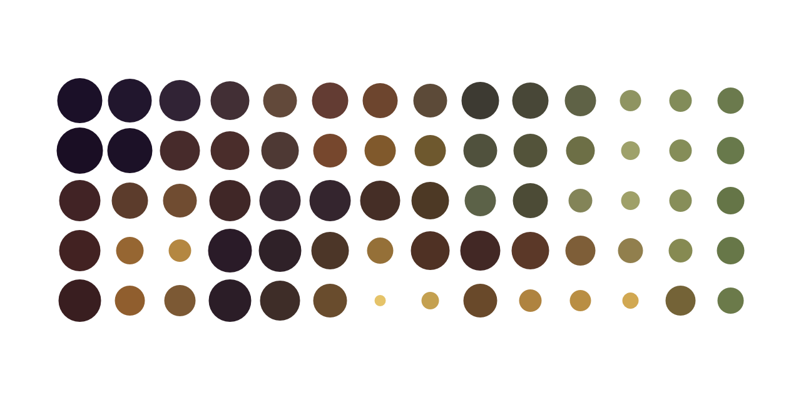
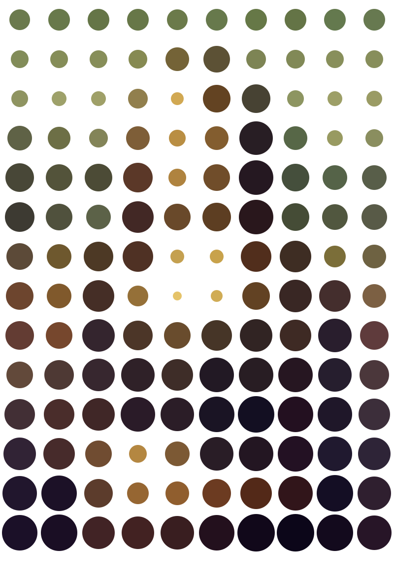

# Points

Simple utility for turning a bitmap into colored dots whose diameter
is proportional to the luminescence of the region the dot represents
and the color is the average color of the area.  

The program outputs SVG since this is usually more useful than a
bitmap if you plan to use the output as part of a workflow.

This program is probably slow, and fairly suboptimal stemming from the
fact that I have absolutely no experience writing graphics utilities.
But hopefully it is easy to read and understand.

## Building and installing

To install 

    go get -u github.com/borud/points

## Usage

    points <flags>

  - **`-f <filename>`** : the input filename.  Accepts JPEG, PNG and GIF as input.
  - **`-o <filename>`** : the output filename. Default is original name with SVG suffix.
  - **`-b <int>`** : the box size in pixels.
  - **`-t`** : luma threshold (0.0 to 1.0)
  - **`-l`** : use BT.701 luma function instead of BT.601 to give more
    weight to red and blue
  - **`-c`** : use average color for area rather than just black (default true)

Example usages

    ./points -f test.jpg -o mytest.svg -b 50 -t 0.6 
	
This produces the file `test.svg` with a box size of 50, a luma
threshold of 0.6 and writes it to `mytest.svg`.

## Box size

The box size refers to the size of the box each circle represents.
Since the box is square it represents the length of a side measured in
pixels.  So a value of 30 means that the image is divided into boxes
that are 30x30 pixels in size.

## Luma Threshold

The Luma Threshold is used to eliminate small dots to make a more
pleasing picture.  Since the diameter of the dots represents how dark
they are, dots representing bright areas will be very small and thus
make the picture look noisy.

  - A value of 1.0 includes all the dots.
  - A value of 0.0 removes all the dots.

# Some examples

    ./points -f mona.jpg -b 15

    ./points -f mona.jpg -b 80

    ./points -f mona.jpg -b 10 -m -t 0.3

